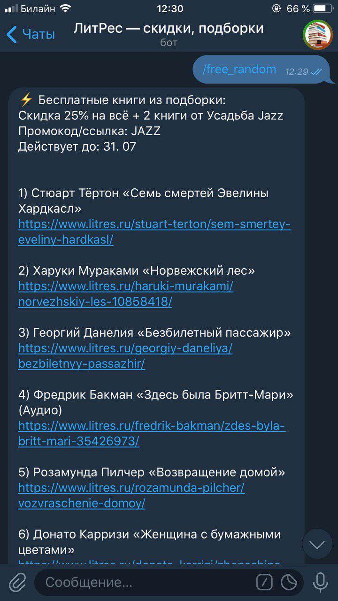

# Telegram bot «ЛитРес — скидки, подборки»

Бот помогает экономить при покупке книг на сайте [ЛитРес](https://www.litres.ru). Используется агрегатор скидок [ЛовиКод](https://lovikod.ru/knigi/promokody-litres).

Основная функция — поиск интересующей книги среди бесплатных подборок. Для этого надо отправить боту ссылку на книгу. 

Если её нет в подборках, бот может предложить другие бесплатные книги или скидки, действующие на все книги.

### Ссылка: ###
https://t-do.ru/litresbestprice_bot

### Скриншоты: ###

