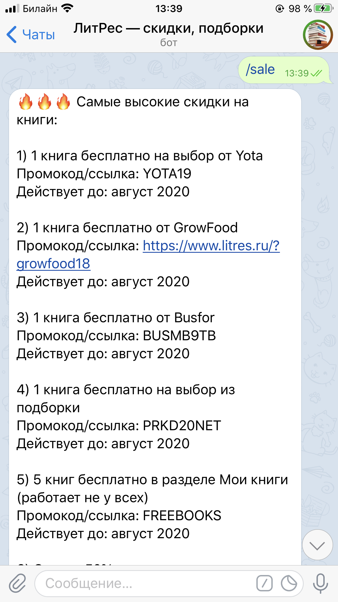

# Telegram bot «ЛитРес — скидки, подборки»

Бот помогает экономить при покупке книг на сайте [ЛитРес](https://www.litres.ru). Используется агрегатор скидок [ЛовиКод](https://lovikod.ru/knigi/promokody-litres).

### Что может бот:

- В сообщении можно отправить название книги, имя, фамилию автора, бот будет искать совпадения среди книг из бесплатных подборок
- Команда `/sale`: промокоды с 10 самыми высокими скидками
- Если этого недостаточно, команда `/more_sales` с еще 20 промокодами
- Команда `/free_random`: случайно выбранные книги, которые сейчас раздаются бесплатно

### Установка:

- `pip install -r requirements.txt`

* Создать нового бота через [@BotFather](https://t.me/botfather) 
* Создать файл `token_storage.py` и поместить в переменную `TOKEN` выданный токен
* Открыть на компьютере браузер Tor (необходим для парсинга litres.ru)

- `python parse_litres.py`

- `python main.py`

### Скриншоты: ###

